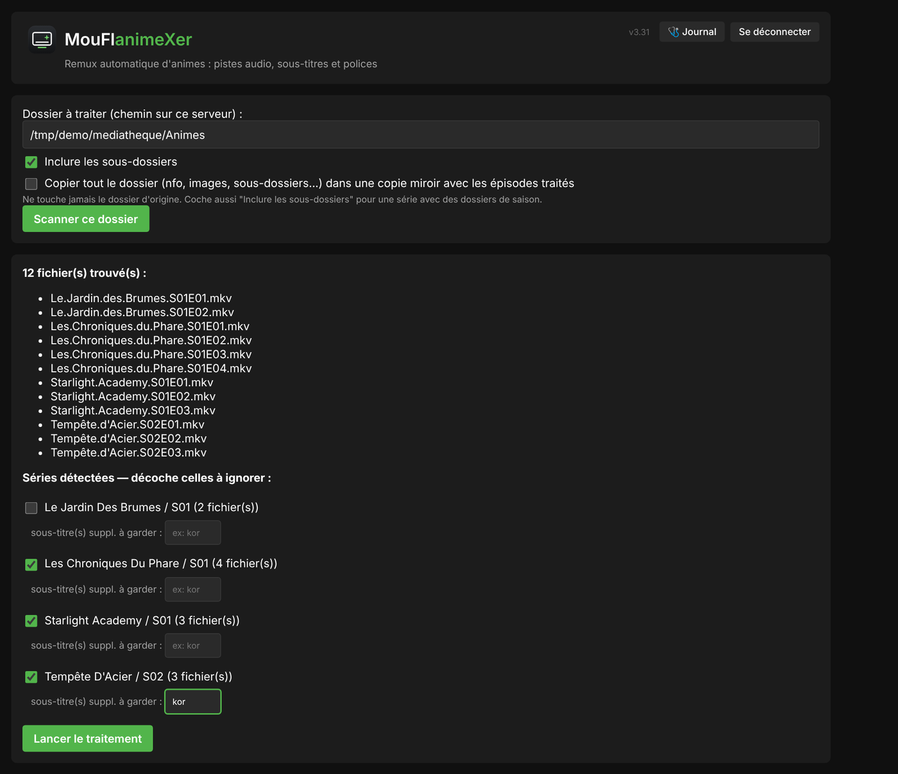
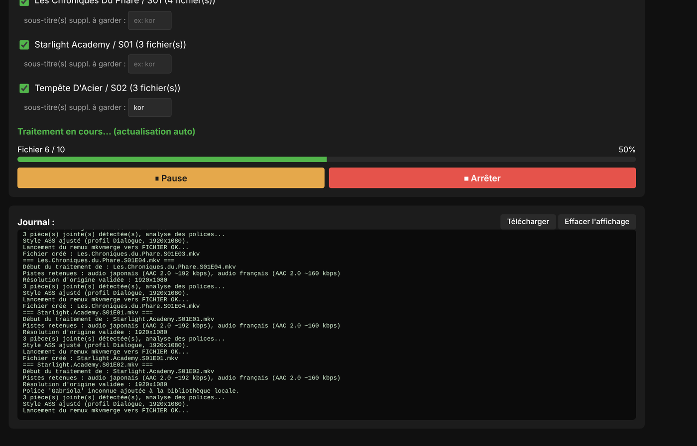
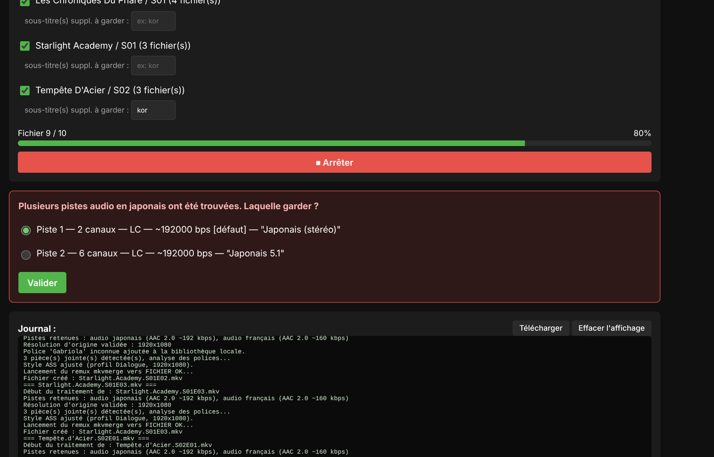
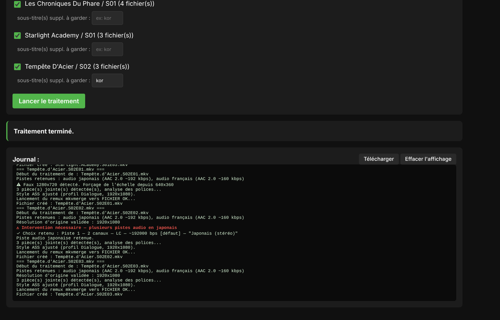
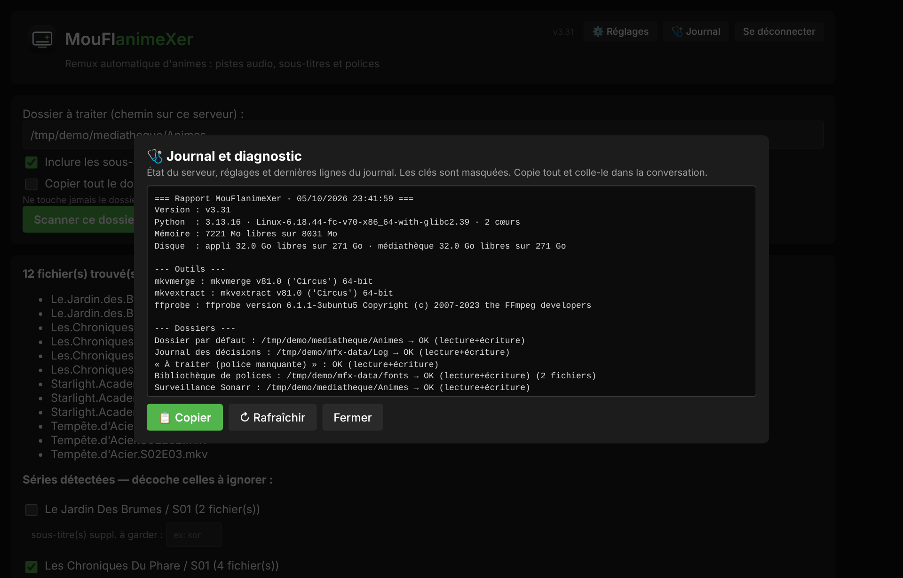
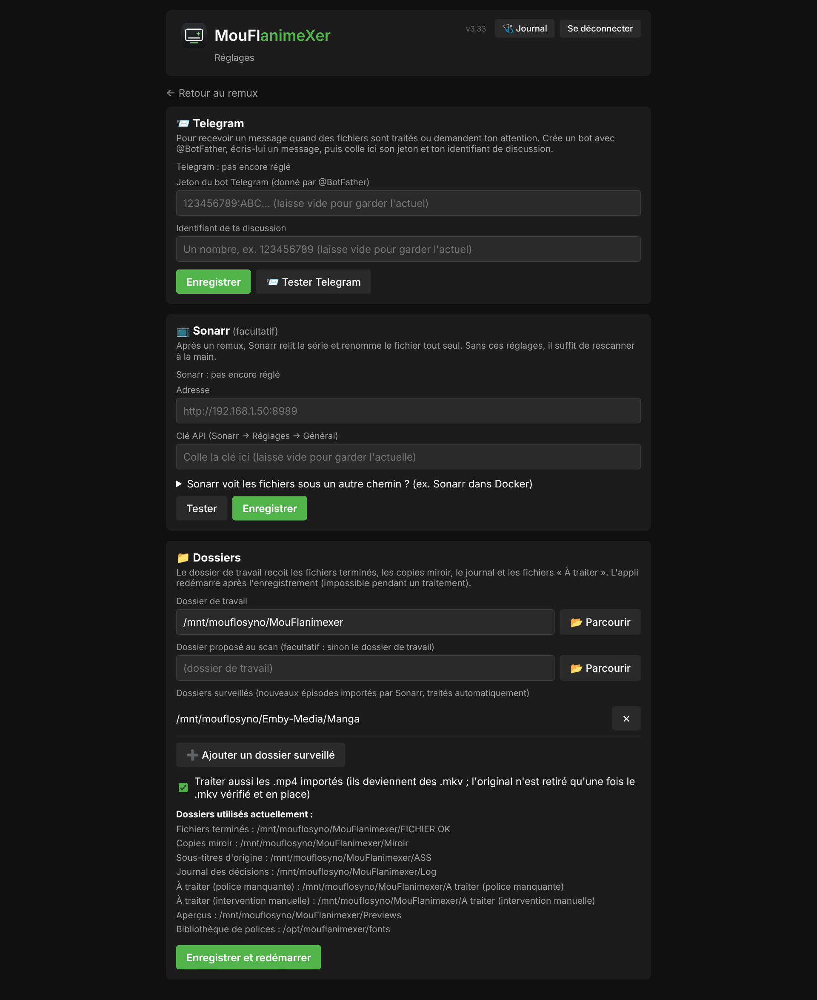
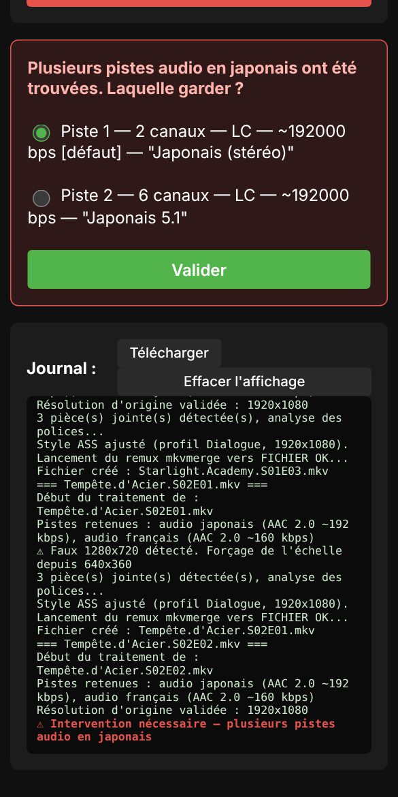

# MouFlanimeXer 🎬✨

[](LICENSE)
[](https://www.python.org/downloads/)

**Remuxeur automatique de fichiers anime MKV/MP4 avec retraitement avancé des sous-titres et polices.**

Redimensionne les sous-titres ASS, gère les pistes audio/sous-titres multiples (français/japonais), unifie les styles typographiques, détecte les résolutions réelles cachées, et supporte l'OCR pour les sous-titres bitmap (PGS).

## 📸 Aperçu

*Captures avec des données de démonstration.*

**Après le scan : les séries trouvées, à cocher ou décocher**



**Un traitement en cours, avec progression, pause et journal**



**L'appli s'arrête et demande quand un choix est nécessaire (ici, quelle piste audio garder)**



**Traitement terminé, journal complet**



**La fenêtre « Journal et diagnostic »**



**La page ⚙️ Réglages : Telegram, Sonarr et dossiers utilisés**



**Sur téléphone**



## ✨ Fonctionnalités

### Gestion Audio/Sous-titres
- 🎵 **Réorganisation automatique** : audio japonais en priorité + défaut, français en 2e
- 🚫 **Filtrage intelligent** : suppression de pistes audio parasites (CC, descriptive)
- 📝 **Sous-titres ASS/SRT/PGS** : conversion et retraitement unifiés
- 🔍 **Détection avancée** : identification des fausses résolutions déclarées, polices imposées (\fn)

### Style et Typographie
- 📐 **Redimensionnement précis** : rescaling de la résolution cible 1920x1080 avec calcul de facteur (ex: 640×360 → ×3)
- 🎨 **Harmonisation des styles** : police Trebuchet MS 66px (dialogues), Arial 63px (incrustations)
- 📐 **Effets mis à l'échelle** : positions, déplacements, découpes (`\clip`, `\iclip`, y compris en forme de dessin), dessins vectoriels (`\p1`), bordures et ombres (y compris `\xbord`/`\ybord`/`\xshad`/`\yshad`), espacement des lettres ; vieux fichiers SSA compris
- 🌫️ **Flou préservé** : les effets `\blur`/`\be` sont gardés tels quels et signalés dans le journal
- 📏 **Marges personnalisées** : préservation intelligente des marges sur les lignes de dialogue
- 🆎 **Polices manquantes** : détection avec upload UI, mémorisation dans `/opt/mouflanimexer/fonts`

### Détection Intelligente
- 🤖 **Heuristique poids de piste** : deux sous-titres FR identiques → la plus lourde = complète, la plus légère = forcée
- 🏷️ **Classification automatique** : détecte "forcé" dans le nom même sans flag technique MKV
- 🎯 **Styles personnalisés** : détecte le style de dialogue principal (Default, Dialogue, DIA, etc.) et l'applique partout
- ⚠️ **Alertes flou** : notification dans le journal avec ligne/style/texte pour retrouver dans Aegisub

### Intégrations & Automatisation
- 📡 **Sonarr → Traitement → Emby** : watcher cron détecte nouveaux fichiers, traite en place, intègre à la biblio
- 🎞️ **MP4 aussi** : le traitement automatique prend aussi les .mp4 importés par Sonarr (ils deviennent des .mkv ; l'original n'est retiré qu'une fois le .mkv vérifié et en place) — réglable
- 🔀 **Sonarr dans Docker** : correspondance de chemins réglable (ex. `/tv` ↔ `/mnt/mouflosyno/Emby-Media/Manga`)
- 🛡️ **Sécurités** : fichier produit vérifié avant de remplacer l'original, un seul passage du surveillant à la fois, essais espacés en cas d'échec, alerte Telegram si le partage réseau n'est pas monté
- 🗂️ **FICHIER OK rangé par série** : deux épisodes de séries différentes au même nom ne s'écrasent plus
- 📱 **Notifications Telegram** : alertes fichiers zappés, bugs inattendus (à régler depuis la page ⚙️ Réglages)
- ⚙️ **Page Réglages** : Telegram, Sonarr et liste des dossiers, même page que dans MouFloster et MouFlopening
- 🔄 **Auto-déploiement GitHub** : git pull auto toutes les minutes, redémarrage du service si changements
- 🌙 **Mode sombre** : interface web responsive avec toggle clair/sombre (localStorage)

### Formats pris en charge
- 📦 **Conteneurs** : MKV (natif), MP4 (détection + conversion → MKV)
- 📄 **Sous-titres** : ASS (retraitement), SRT (conversion → ASS), PGS (OCR → ASS)
- 🎥 **OCR** : tesseract-ocr + tesseract-ocr-fra pour pistes bitmap

## 🚀 Installation

### Prérequis
- Python 3.9+
- FFmpeg / FFprobe
- MKVToolNix (mkvmerge, mkvextract, mkvinfo)
- Tesseract OCR (optionnel, pour sous-titres PGS)

### Installation sur Proxmox/LXC

```bash
# Cloner le dépôt
git clone https://github.com/mouflo/mouflanimexer.git /opt/mouflanimexer
cd /opt/mouflanimexer

# Créer environnement virtuel
python3 -m venv venv
source venv/bin/activate

# Installer dépendances
pip install -r requirements.txt

# Installer outils système
apt-get install ffmpeg mkvtoolnix tesseract-ocr tesseract-ocr-fra
```

## 📖 Utilisation

### Mode Interactif Web

```bash
cd /opt/mouflanimexer
source venv/bin/activate
python3 mouflanimexer.py
```

Puis ouvre `http://localhost:5000` (identifiant et mot de passe définis avec `bash set-login.sh`)

**Flux:**
1. **Scan** → détection de la série/saison
2. **Affichage** → fichiers trouvés avec infos pistes
3. **Questions interactives** → validation des choix ambigus (full/forcé, marges, polices)
4. **Traitement** → remuxage et retraitement des sous-titres
5. **Sortie** → fichiers finalisés dans `FICHIER OK/`, fichiers zappés dans `À TRAITER/`

### Mode Watcher Sonarr (Automatisé)

```bash
# Initialiser état des fichiers existants (UNE SEULE FOIS)
python3 mouflanimexer.py --seed-sonarr-state

# Puis ajouter à crontab (toutes les 2 minutes):
*/2 * * * * /opt/mouflanimexer/venv/bin/python3 /opt/mouflanimexer/mouflanimexer.py --watch-sonarr >> /opt/mouflanimexer/watcher.log 2>&1
```

### Mode Service Systemd

```bash
# Activer et démarrer le service
systemctl enable mouflanimexer
systemctl start mouflanimexer
systemctl status mouflanimexer

# Journal
journalctl -u mouflanimexer -f
```

### Auto-déploiement GitHub

Ajouter à crontab root (toutes les minutes):
```bash
* * * * * /opt/mouflanimexer/deploy.sh >> /opt/mouflanimexer/deploy.log 2>&1
```

## ⚙️ Configuration

### Dossiers

Tout se règle dans la page **⚙️ Réglages** → Dossiers (avec un explorateur pour choisir les dossiers) :

- **Dossier de travail** (par défaut `/mnt/mouflosyno/MouFlanimexer`) : il reçoit `FICHIER OK/`, `Miroir/`, `ASS/`, `Log/`, `Previews/` et les dossiers « À traiter » ;
- **Dossier proposé au scan** (facultatif) ;
- **Dossiers surveillés** par le traitement automatique Sonarr (par défaut `/mnt/mouflosyno/Emby-Media/Manga`).

Les réglages sont enregistrés dans `data/paths.json` sur le serveur (jamais sur GitHub). Sans ce fichier, les chemins par défaut ci-dessus sont utilisés.

### Sonarr (optionnel)

Page **⚙️ Réglages** → Sonarr : adresse et clé API (bouton « Tester »). Enregistré dans `sonarr_api_config.json` (hors dépôt git).

### Telegram (optionnel)

Le plus simple : page **⚙️ Réglages** → Telegram (le jeton est vérifié, puis un message de test est envoyé). Le résultat est enregistré dans `telegram_config.json` (hors dépôt git) :

```json
{
  "bot_token": "123456:ABCDEFG...",
  "chat_id": "123456789"
}
```

### excluded_series.json (Auto-généré)

Géré via l'interface web → cases à cocher par série + sauvegarde automatique

## 🎨 Interface Web

### Fonctionnalités
- ✅ Page de connexion (identifiant et mot de passe à toi)
- 📊 Affichage hiérarchique (Série/Saison/Épisode)
- 🖼️ Miniatures vidéo générées par FFmpeg (repérage des problèmes)
- ❓ Boîtes de question en rouge (repérage immédiat)
- 📋 Journal scrollable + bouton télécharge en .txt
- ⏸️ Pause/reprendre le traitement (thread-safe)
- 🌙 Toggle clair/sombre
- 📱 Responsive (mobile, tablette, desktop)

## 📊 Architecture

```
mouflanimexer/
├── mouflanimexer.py         # Application principale
├── requirements.txt          # Dépendances Python
├── venv/                     # Environnement virtuel
├── fonts/                    # Bibliothèque de polices (.ttf/.otf)
├── static/                   # CSS, JS (interface web)
├── templates/                # Templates HTML (Jinja2)
├── deploy.sh                 # Script auto-déploiement GitHub
├── telegram_config.json      # Config Telegram (hors git)
├── excluded_series.json      # Séries ignorées (auto-généré)
├── watcher.log              # Logs du watcher Sonarr
├── deploy.log               # Logs déploiement auto
└── FICHIER OK/              # Fichiers traités ✅
```

## 🔄 Workflow Complet (Sonarr → Emby)

1. **Sonarr télécharge** → `/mnt/mouflosyno/Emby-Media/Manga/Serie/S01/episode.mp4`
2. **Cron watcher** → détecte fichier, lance `--watch-sonarr`
3. **MouFlanimeXer** → traite, remplace en place (hardlinks)
4. **Emby scan** → actualise biblio, affiche nouveau poster/métadonnées
5. **Notifications** → Telegram si problème (police manquante, ambiguïté)

## 🐛 Dépannage

### Sous-titres énormes après traitement
**Cause** : PlayResX/PlayResY absents ou mal configurés  
**Solution** : MouFlanimeXer les ajoute auto maintenant (v2.4+)

### Piste forcée seule trouvée
**Cause** : Fansub a mal classé  
**Solution** : Auto-reclassée en piste complète (v2.4+)

### Polices manquantes
**Action** : Fichier déplacé vers `À TRAITER/`, notif Telegram  
**Solution** : Upload via interface web ou ignorer

### Double redimensionnement (résolution fake)
**Cause** : Déclaration 1920×1080 mais contenu 640×360  
**Solution** : Heuristique `get_true_orig_res()` détecte et recalcule facteur

## 📝 Historique des Versions

- **v1.0-1.22** : Prototype web interactif, fonctions audio/sous-titres, détection des polices
- **v2.0-2.5** : Corrections heuristiques, miroir, bug PlayResX/Y
- **v3.0-3.1** : Prise en charge PGS (OCR), Sonarr watcher, auto-déploiement GitHub
- **v3.29** : Watcher résilient (os.walk vs rglob), notifications Telegram

## 🤝 Contribution

Consulte [CONTRIBUTING.md](.github/CONTRIBUTING.md) pour les directives.

## 📄 Licence

MIT - voir [LICENSE](LICENSE)

## 📞 Aide

Un problème ? Ouvre une [issue sur GitHub](https://github.com/mouflo/mouflanimexer/issues).

---

Créé avec ❤️ pour les passionnés d'anime • [MouFloster](https://github.com/mouflo/MouFloster) • [MouFlopening](https://github.com/mouflo/MouFlopening)
